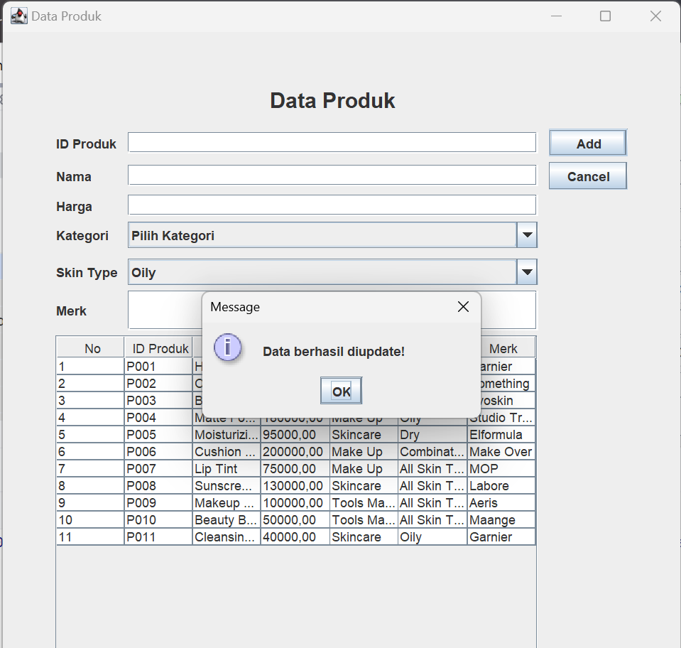

# TP4DPBO2425C2
Saya Fauzia Rahma Nisa mengerjakan Tugas Praktikum 4 dalam mata kuliah Desain dan Pemrograman Berdasarkan Objek untuk keberkahanNya maka saya tidak melakukan kecurangan seperti yang telah dispesifikasikan. Aamiin.

**1. Desain Program**

a. Atribut Class
- id (String)
- nama (String)
- harga (double)
- kategori (String)
- skinType (String)
- merk (String)

b. Elemen elemen GUI yang digunakan
- JTextField untuk input ID, nama, harga, dan merk.
- JComboBox untuk memilih kategori produk dan jenis kulit.
- JTable untuk menampilkan daftar produk secara terstruktur.
- JButton untuk melakukan operasi seperti Add, Update, Delete, dan Cancel.

c. Method

Memiliki empat fungsi utama yang diimplementasikan dalam metode:
- insertData() → Menambahkan data baru ke dalam daftar produk.
- updateData() → Memperbarui data produk yang dipilih pada tabel.
- deleteData() → Menghapus produk yang dipilih setelah konfirmasi.
- clearForm() → Membersihkan seluruh field input dan mengatur ulang tampilan form.

  Saat pengguna menekan tombol Add, data dari input field akan disimpan ke dalam ArrayList dan langsung di tampilkan di tabel. Saat pengguna mengklik salah satu baris pada tabel, data produk akan muncul kembali ke form sehingga dapat diedit (Update) atau dihapus (Delete). Tombol Cancel dapat digunakan untuk mengosongkan seluruh input form.

  Program dilengkapi dengan data contoh awal melalui metode populateList(), sehingga pengguna langsung dapat melihat isi tabel saat pertama kali menjalankan aplikasi.
  

**2. Penjelasan Alur**

a. Program Dijalankan
- Ketika kelas ProductMenu dijalankan, JFrame akan ditampilkan di layar.
- Program secara otomatis memanggil metode populateList() untuk mengisi daftar produk awal ke dalam ArrayList dan menampilkannya di tabel (JTable).

b. Menampilkan Data Produk
- Semua data yang ada di dalam listProduct ditampilkan secara otomatis di tabel utama menggunakan metode setTable().
- tabel berisi informasi: No, ID Produk, Nama, Harga, Kategori, Skin Type, dan Merk.

c. Menambahkan Produk Baru
- Pengguna mengisi field input: ID, Nama, Harga, Kategori, Skin Type, dan Merk.
- Setelah semua terisi, pengguna menekan tombol Add. nah program menjalankan metode insertData() yang akan membuat objek Product baru, Menambahkannya ke dalam ArrayList dan memperbarui tampilan tabel agar data baru langsung muncul.

d. Memilih & Mengedit Produk (Update)
- Pengguna dapat memilih salah satu baris data di tabel dengan mengkliknya.
- tombol Add akan berubah menjadi Update.
- Data dari baris tersebut otomatis ditampilkan kembali ke form input.
- Setelah pengguna mengubah isi field, tekan tombol Update dan data yang ingin diupdate akan berubah.

e. Menghapus Produk
- Pengguna memilih data yang ingin dihapus dengan mengklik baris pada tabel.
- Kemudian menekan tombol Delete.
- Program akan meminta konfirmasi penghapusan melalui dialog.
- Jika pengguna memilih Yes, maka metode deleteData() dijalankan untuk menghapus data dari ArrayList dan memperbarui tabel agar data tersebut hilang dari tampilan.

f. Membatalkan Input (Cancel)
- Tombol Cancel dapat ditekan kapan saja untuk mengosongkan seluruh input.
- Ini dilakukan melalui metode clearForm().

**3. Dokumentasi saat program dijalankan**

a. Tampilan Awal

b. Add

c. Update

d. Cancel

d. Delete

